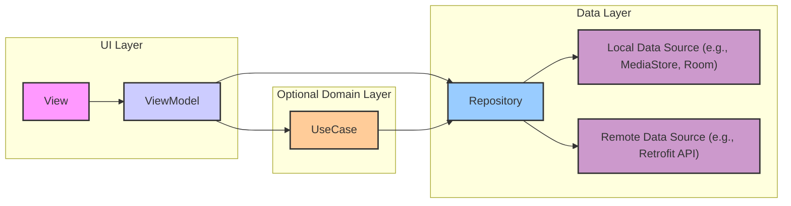

# MVVM 架构设计

com.aoeai.media/
├─ data/               // 数据层
│  ├─ repository/      // 仓库实现
│  ├─ source/          // 数据源
│  │  ├─ local/        // 本地数据源(数据库、偏好设置等)
│  │  └─ remote/       // 远程数据源(API服务)
│  └─ model/           // 数据模型类
│
├─ domain/             // 领域层(可选)
│  ├─ model/           // 领域模型
│  ├─ repository/      // 仓库接口
│  └─ usecase/         // 用例类
│
├─ ui/                 // UI层
│  ├─ common/          // 通用UI组件
│  └─ feature/         // 按功能分组
│     ├─ gallery/      // 相册功能
│     │  ├─ view/      // Compose/Fragment/Activity
│     │  └─ viewmodel/ // 相册相关ViewModel
│     └─ detail/       // 照片详情功能
│        ├─ view/      
│        └─ viewmodel/
│
├─ util/               // 工具类
│
└─ di/                 // 依赖注入(如使用Hilt/Koin/Dagger)

## 职责说明

- data：处理所有数据操作，隐藏数据来源细节
- ui：只关注界面展示和用户交互
- domain：包含业务逻辑和用例(在小项目中可省略)

## 层级间调用关系

单向依赖原则

View → ViewModel → UseCase/Repository → DataSource

### 依赖方向总结
- View 依赖 ViewModel
- ViewModel 依赖 Repository（或 UseCase）
- Repository 依赖 Data Source（remote/local）
- UseCase 依赖 Repository（如有domain层）
依赖方向始终是单向的，数据流动是自下而上，事件流动是自上而下。

### 核心层级对应的目录：

- View : ui/featureX/ 下的 Activity 或 Fragment 文件。
- ViewModel : ui/featureX/ 下的 ViewModel 文件。
- Model (数据层) : 主要体现在 data/ 目录下，包括 model/ , repository/ , remote/ , local/ 。
- Repository : data/repository/ 目录。
- Data Sources : data/remote/ 和 data/local/ 目录。
- UseCase (领域层) : domain/usecase/ 目录。

## 层级调用关系
MVVM架构强调 单向数据流 和 依赖关系 ：

1. View (UI层) :
   
   - 持有 ViewModel 的引用。
   - 观察 ViewModel 暴露的 LiveData 或 StateFlow 等数据流以更新UI。
   - 将用户的交互事件（点击、滑动等） 通知 给 ViewModel。
   - 不直接 与 Repository 或 Data Source 交互。
2. ViewModel (UI层) :
   
   - 持有 Repository (或 UseCase) 的引用。
   - 不持有 View 的引用（通常通过 LiveData / StateFlow 与View通信）。
   - 不直接 访问 Data Source。
   - 负责处理UI逻辑，响应View的事件，调用Repository/UseCase获取数据，并将处理后的数据/状态暴露给View。
   - 通常与UI生命周期相关联 ( viewModelScope )。
3. UseCase (领域层 - 可选) :
   
   - 持有 一个或多个 Repository 的引用。
   - 封装单一、具体的业务逻辑。
   - 被 ViewModel 调用。
   - 使 ViewModel 更轻量，业务逻辑更清晰、可复用、易测试。
4. Repository (数据层) :
   
   - 持有 Local Data Source 和/或 Remote Data Source 的引用。
   - 作为数据访问的 唯一入口 (Single Source of Truth)。
   - 负责协调不同的数据源（网络、数据库、缓存），决定从哪里获取数据以及如何存储数据。
   - 向上层（ViewModel 或 UseCase）屏蔽数据来源的细节。
   - 您代码中的 `PhotoRepository.kt` 就是 Repository 层的典型实现，它负责与 MediaStore (一种 Local Data Source) 交互。
5. Data Sources (数据层) :
   
   - 负责具体的数据获取和存储操作（如执行数据库查询、网络请求）。
   - 被 Repository 调用。

### 依赖关系图

